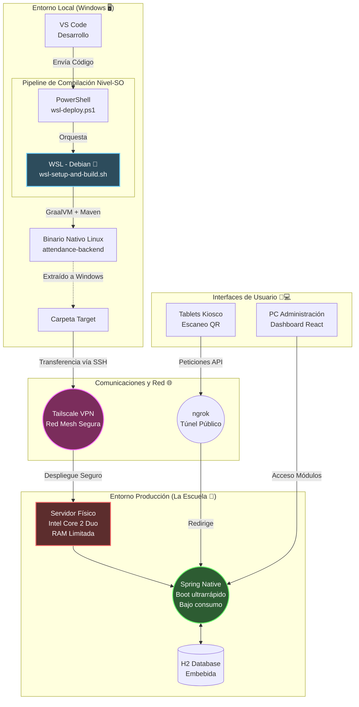

# 📊 Infografía Arquitectónica: Sistema de Asistencia (Fase 1)

Aquí tienes una representación visual de la arquitectura y el pipeline de despliegue, ideal para acompañar tu publicación (puedes tomar captura de pantalla del diagrama o usarlo como guía para diseñar una gráfica final).

## Arquitectura y Despliegue

### 🔑 Puntos Clave de la Arquitectura:

1. **💻 Desarrollo fluido:** Escribes tu código en Windows, pero compilas a nivel de sistema operativo Linux gracias a la potente integración con **WSL**.
2. **⚡ Optimización Extrema:** **GraalVM** toma la aplicación en Java y la convierte en un binario ejecutable que corre nativamente en un servidor muy antiguo (Core 2 Duo), optimizando memoria y CPU al máximo frente a una JVM tradicional.
3. **🔒 Seguridad y Testing:** **Tailscale** actúa como un puente directo invisible para manejar el servidor remotamente sin abrir puertos, mientras que **ngrok** permite hacer exposiciones temporales controladas para probar los escáneres QR de las tablets.
4. **🌱 Escalabilidad:** A pesar de los recursos limitados en servidor, la estructura bajo el capó (JPA, React, Spring Security) ya prepara el terreno para la gestión modular completa del ciclo escolar.
